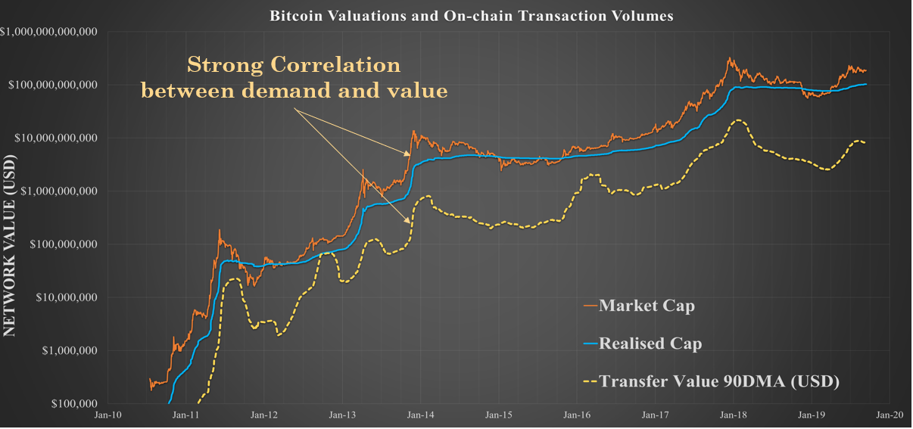
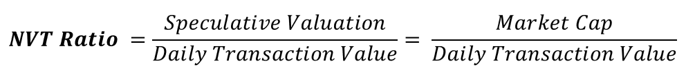
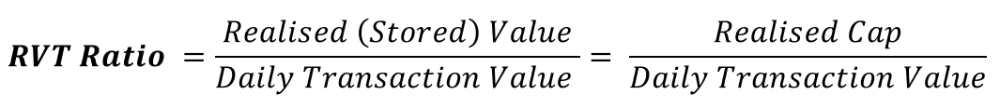
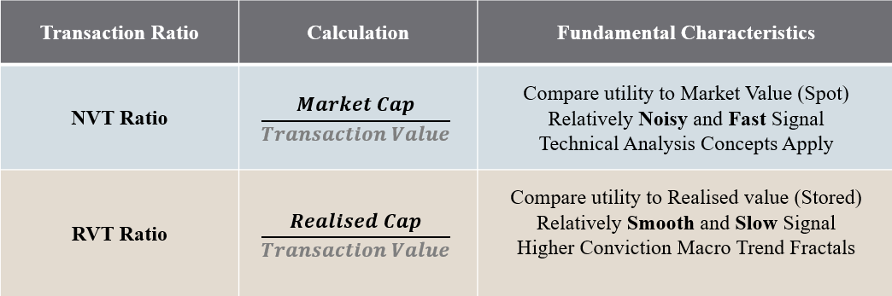
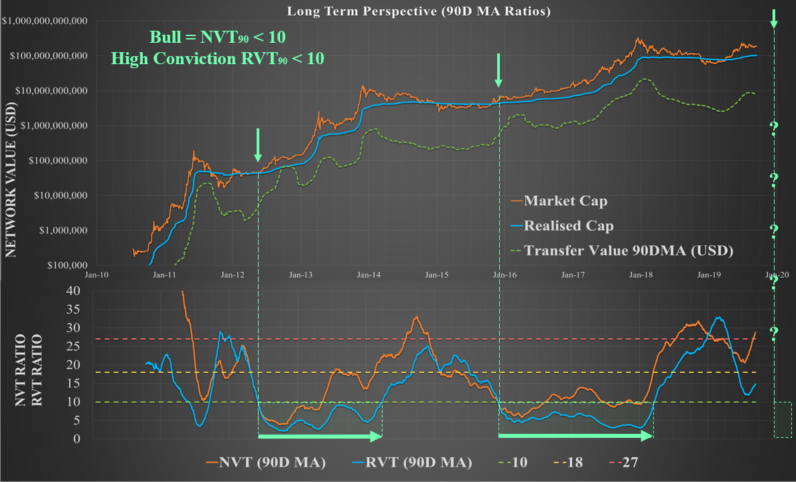
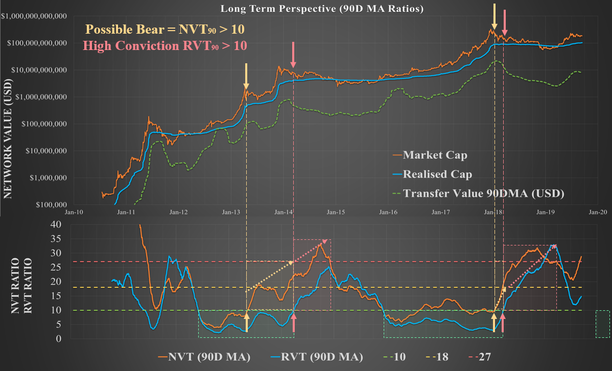
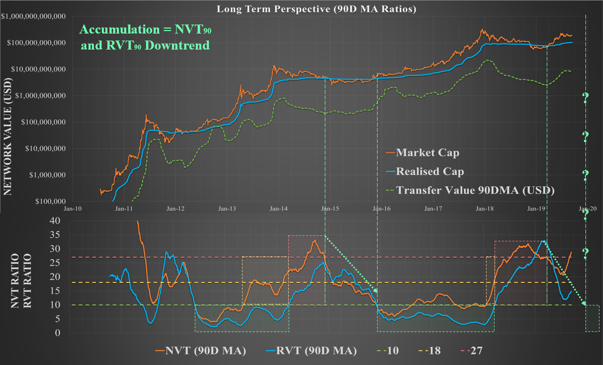

# The Bitcoin RVT Ratio, A High Conviction Macro Indicator

Bitcoin has a constantly developing suite of on-chain analysis metrics to aid traders and investors in making informed market decisions. This paper presents the **Realised Value to Transaction Ratio** (the RVT Ratio). This study is a slower but higher conviction counterpart to the **Network Value to Transaction Ratio** (the NVT Ratio) that was originally developed by [Willy Woo](https://www.forbes.com/sites/wwoo/2017/09/29/is-bitcoin-in-a-bubble-check-the-nvt-ratio/) and iterated into the NVT Signal by [Dmitry Kalichkin](https://medium.com/cryptolab/https-medium-com-kalichkin-rethinking-nvt-ratio-2cf810df0ab0). 

The NVT and RVT ratios are akin to a Price to Earnings Ratio (PE Ratio) for Bitcoin as it compares the value flowing through the network to the relevant valuation. In various forms (smoothign averages and signal), these ratios, when used in tandem, have shown to provide high conviction signals regarding Bitcoin market direction across multiple timeframes.

## Resources

**If you are new to on-chain analysis looking for somewhere to start or prefer video format, I cover everything you need to know about both the NVT and the RVT ratios as part of our [Ready Set Crypto Bitcoin Masterclass](https://www.youtube.com/watch?v=_Spm1c-aZmo)**.

- Both the NVT and RVT ratios are presented by Willy Woo at [woobull.com](http://charts.woobull.com/).

- All data presented in this paper is sourced from the [Coinmetrics.io community dataset](https://coinmetrics.io/charts/).

- [This chart from Coinmetrics](https://coinmetrics.io/charts/#assets=btc_zoom=1284478560000,1568764800000_formula=W1siTWFya2V0IFByaWNlIiwiUmVkIiwwLCJCVEMuUHJpY2VVU0QiXSxbIlJlYWxpc2VkIFByaWNlIiwiQmx1ZSIsMCwiQlRDLkNhcFJlYWxVU0QvQlRDLlNwbHlDdXIiXSxbIk5WVF8yOCIsIk9yYW5nZSIsMSwic21hKEJUQy5DYXBNcmt0Q3VyVVNEL0JUQy5UeFRmclZhbFVTRCwyOCkiXSxbIk5WVFMiLCJWaW9sZXQiLDEsIkJUQy5DYXBNcmt0Q3VyVVNEL3NtYShCVEMuVHhUZnJWYWxVU0QsMjgpIl0sWyJSVlRfMjgiLCJQdXJwbGUiLDEsInNtYShCVEMuQ2FwUmVhbFVTRC9CVEMuVHhUZnJWYWxVU0QsMjgpIl0sWyJSVlRTIiwiRGFya1R1cnF1b2lzZSIsMSwiQlRDLkNhcFJlYWxVU0Qvc21hKEJUQy5UeFRmclZhbFVTRCwyOCkiXV0) is setup with all NVT, RVT and Pricing models considered in this paper for readers to experiment themselves.

# Part 1 - Background to Transaction Flow Metrics
The utilisation of Bitcoin as a transfer and savings mechanism carries an on-chain signature as coins are transferred between addresses. Since we can monitor these on-chain transactions, it is possible to evaluate:

- The **Volume of BTC** that is being transferred over the network
- The **Value in USD** transferred by assigning a price at the time of the transaction

The Volume of BTC is considered an **on-chain property** whilst the corresponding value in USD is an applied measure, reliant on a data feed (price) that is external to the Bitcoin protocol.

Given the fixed supply of BTC, it reasonably follows that a high or increasing demand for on-chain BTC volume should result in a corresponding increase in the networks value (and vice-versa). Indeed this is what has been observed through the first 10 years of Bitcoin history and we can see a strong correlation between on-chain transaction flows and Bitcoin Market Valuation.

As can be seen in the chart below of Bitcoin's 10 year history, there is a strong correlation between demand for on-chain transactions and the market capitalisation of the Bitcoin network.

## The NVT Ratio

The **NVT ratio** provides a gauge to whether the current demand for Bitcoin block-space justifies the present market valuation. Through observing historical fractals it becomes possible to identify periods of over or under valuation of the Bitcoin network.

The **NVT Ratio** simply calculated by dividing the Bitcoin Market Cap by the Daily On-chain Transaction Value in USD.

Since transaction flow fluctuates on a daily basis and is a relatively noisy metric. It is advised to apply smoothing average depending on the timescale and trading strategy employed. Some useful examples are shown in the table below and demonstrated in subsequent examples.

In Summary:
- The 28 day MA is useful as a macro view over a market cycle (2-3 years)
- The 90 day MA is useful as a macro view over Bitcoin's full history
- The NVTS or RVTS takes the average of only transaction volume making it more sensitive to movements in price. Thus is it best applied as a trading indicator and tends to adhere to basic technical analysis.

## The RVT Ratio

The **RVT Ratio** is based off the same principles as the **NVT Ratio** however utilises the **Realised Cap** rather than the **Market Cap** in the numerator. 

The [**Realised Cap** is an on-chain metric](https://coinmetrics.io/realized-capitalization/) that estimates the wealth stored in Bitcoin by valuing each UTXO at the price it was last transacted. The Realised Cap is thus a Bitcoin value model that represent the average cost basis of the entire market whilst also discounting lost coins.

The Realised Cap has shown to be a naturally smoother and less volatile measure of network valuation than the Market Cap as it filters out off-chain exchange volume and lightning network and sidechain transactions. As such, both the Realised Cap and the RVT Ratio are shielded from day-to-day market sentiment, emotion and speculation that are reflected in price and Market Cap.

The RVT provides a higher conviction, albeit slower signal specially tuned to the macro sentiment of Bitcoin HODLers. The NVT Ratio in contrast is subject to daily price volatility and provides insight into the behaviour of daily market participants. 

When used in tandem, these two ratios provide a powerful gauge of the Bitcoin demand relative to network valuation.
- The NVT provides a **noisy but fast** indicator
- The RVT provides a **slower but high conviction** indicator

One of the key strengths of the RVT signal over the NVT is that the Realised Price itself is an on-chain native metric. As such, there is a relationship between the RVT and the Realised Cap that is native to the chain which is not replicated by the NVT and Market price. As a result, it is likely that the RVT will retain signal relevance longer than the NVT and may act as a tool for calibrating fractals over time.

## Mental Framework for the NVT and RVT Ratios

A useful mental framework for studying these ratios is presented here.
- An NVT of 25 means every 25 days, Bitcoin transacts its entire market cap in value.
- An RVT of 10 means every 10 days, Bitcoin transacts its entire realised cap in value.

# Part 2 - NVT and RVT Market Fractals
By studying market history, we can determine behaviour fractals of the NVT and RVT ratio pair that present high conviction market opportunities.

In the following charts and discussions, I present horizontal levels for NVT and RVT charts of 10, 18 and 27. These values have shown historical significance for transitions in market fractals however are guides only and likely to evolve over time. 

## Confirming Bull Markets

During sustainable bull markets, the value flowing through the blockchain is reasonably expected to increase both as the value of bitcoin inflates and with elevated awareness of market participants. This manifests as relatively low NVT and RVT ratios with consistent sideways trading suggesting demand grows in line with price.

The NVT and RVT have historically broken below a value of 10 at the commencement of a Bull, occuring in early 2012 and again in late 2015. The RVT in particular has shown to sustain a value below 10 for the entirity of the 2012-13 and 2015-17 Bull markets, maintaining this value into the early Bear.

The NVT Ratio generally oscillates between a value of around 5 to 18 through bull markets in a sideways pattern. 

Key fractals confirming a sustainable Bull Market are:
- NVT and RVT breaking below 18 indicating increased demand for Bitcoin blockspace relative to market value.
- Strong bullish signal where the NVT and RVT break below 10. 
- Consistent sideways trading of the RVT below 10 and a rangebound NVT below 18 indicate sustainable bullish demand for blockspace with changing network value.

Note: Interestingly, for the early 2019 bull market, the NVT and RVT approached 18 and 10 respectively, before promptly reversing in August 2019. The mechanism behind this may be linked in part to Tether (USDT), a historically constant demand for Bitcoin block-space, [transitioning to the Ethereum blockchain](https://tether.to/usd%E2%82%AE-and-eur%E2%82%AE-now-supported-on-ethereum/) as well as dominance of off-chain leveraged speculation following the April 2019 short squeeze.

## Signalling Weakness in the Bull

In general, the strongest NVT and RVT signal for a weakening Bull is a transition from sideways trading into a distinct uptrend. Bear markets are typically characterised by a dominance of off-chain exchange based trade volume that drives a reduction in the NVT and RVT denominator (increasing the ratio).  

Naturally, the NVT will react first to market tops given its sensitivity to price however at the cost of more noise and more false signals (as seen in early 2013 where it triggered early). The RVT provides a slower but higher conviction signal to confirm this transition to Bear market conditions.

As such, the NVT can provide early warning of a reduced demand for transactions that can be confirmed by similar weakening in the RVT ratio.

Key fractals of market topping are:
- The NVT breaks convincingly upwards from the 5 to 18 range signaling market valuation is beginning to exceed transaction utility.
- Confirmation of a blow-off top and transition to Bear Market conditions by the RVT (particularly the RVT Signal) breaking above 10.

## Capitulation and Accumulation

The capitulation and accumulation phase at the end of Bear markets have two key mechanisms at play; 
1. Weak hands puking out assets. 
2. Heavier investment by smart money.

During the final capitulation, a high volume of sellers transact on-chain seeking an exit. Smart money accumulation then commences, particularly when the market price dips below the realised price, leading to large value transactions on-chain relative to the deflated network valuation.

This has shown to trigger a reversal of the NVT and RVT ratios into a downtrend until such a time that a sustainable bull is back in effect.

Key fractals of the capitulation and accumulation phase are:
- Capitulation generally occurs following NVT and RVT ratios reaching values above 18 to 27 suggesting the network is heavily under-utilised.
- A strong downtrend in the NVT and RVT ratio suggests a change in market character due to the combination of depressed prices, weak hands selling and smart money accumulating.

# Concluding Remarks

Bitcoin is optimised for securely transferring value. The NVT and RVT ratios offer insight into the Bitcoin network valuation normalised against this demand for blockspace. Given the fixed supply nature of bitcoins, increases and decreases in demand for block-space have shown to have a corresponding signal on the macro market trends.

The NVT and RVT ratios are best applied in tandem as a fast/noisy and slow/convincing signal pair. A summary of key metrics useful to the typical Bitcoin HODLer are presented in the table below for reference.

## Limitations and Notes on the Future

The NVT and RVT Ratios rely on on-chain transactions and as the Bitcoin market continues it's exponential evolution, volumes occuring on-chain will similarly evolve over time.

Volume will continue to move off-chain to layer 2 solutions like Lightning Network, sidechains and third party 'crypto banks', exchanges and custodians. As such, the fractals and key levels discussed will likely evolve over time with these shifts in demand.

As noted, the RVT and Realised Cap will likely be more resistant to obselecence in comparison to the NVT as they are more closely native to the chain. I expect the RVT fractals will continue to provide a reasonable fractal benchmark against which the NVT can be recalibrated over time.

