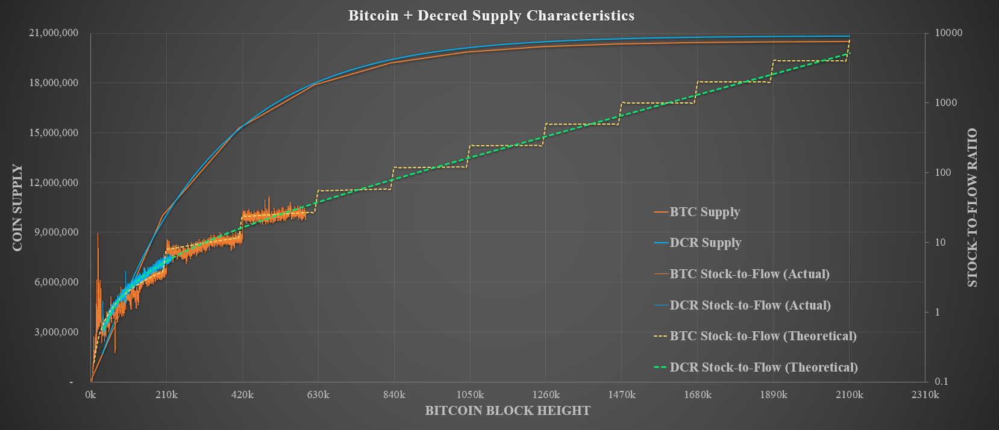
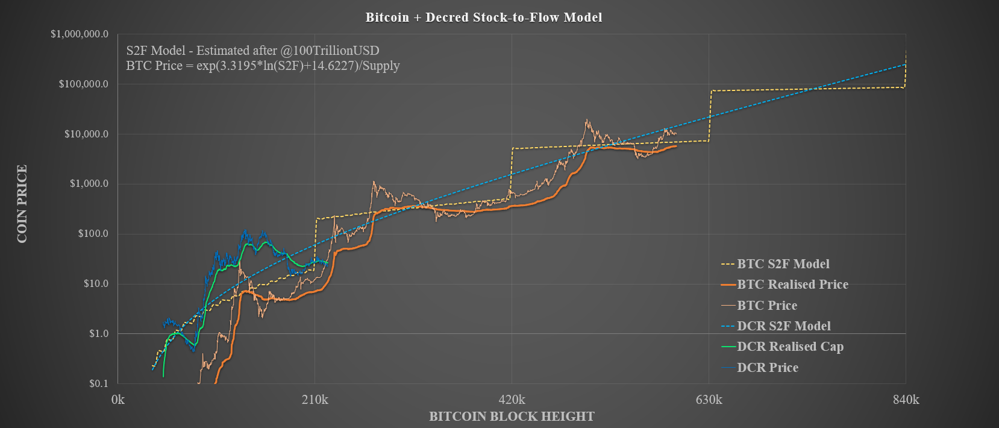

# Decred, following in Bitcoin's Footsteps
**Decred** is in my opinion one of the most promising cryptocurrency projects in the industry. **Decred** is founded on the same core sound money principles as **Bitcoin** yet differentiates significantly in three very meaningful ways, namely:

1. **Decred's** security model and consensus mechanism utilises an innovative Hybrid PoW/PoS system. This provides superior [lender assurances](https://medium.com/@permabullnino/introduction-to-crypto-accounting-an-analysis-of-decred-as-an-accounting-system-4d3e67fce28?source=search_post---------2) (Permabull Nino, 2019) and a [higher cost of attack per unit of market cap](https://medium.com/decred/decreds-hybrid-protocol-a-superior-deterrent-to-majority-attacks-9421bf486292) (Zubair Zia, 2018) when compared to **Bitcoin**.

2. Pre-established governance mechanism which allocates decision making capacity to DCR holders. The governance system is comprised of off-chain signaling via [Politeia](https://proposals.decred.org) and social media channels (Matrix, Twitter, Reddit etc.) and binding on-chain voting via the **Decred** ticket system.

3. Distribution of block rewards allocated as 60% to Proof-of-work miners to cover CAPEX and OPEX costs, 30% to DCR ticket holders to incentivise governance participation and 10% to a **Decred** Treasury that is owned ([and soon to be operated by](https://proposals.decred.org/proposals/c96290a2478d0a1916284438ea2c59a1215fe768a87648d04d45f6b7ecb82c3f)) **Decred** stakeholders. This is in contrast to **Bitcoin's** 100% allocation to Proof-of-Work.

I previously explored a comparison between Alt-coins and **Bitcoin** in regards to their Monetary Premiums considering a simple methodology relating scarcity as measured by stock-to-flow ratio to market value. [Plan B](https://medium.com/@100trillionUSD/modeling-bitcoins-value-with-scarcity-91fa0fc03e25) established the fundamental power law relationship for **Bitcoin** which acts as a valuable baseline against which fixed supply cryptoassets may be compared.

What I want to explore further in this article, is whether **Decred's** market valuation performance to date is comparable in the context of **Bitcoin** in its early history.

## Monetary Policy

In addition to the protocol level differences noted above, there are crucial similarities and differences in the monatary policies Decred and Bitcoin that must be explored in order to make a valid comparison.

### Similarities

**Decred** retains the core sound money principles **Bitcoin** including:
- 21 million maximum unit supply of DCR
- 100,000,000 divisible units (atoms) per DCR
- Deterministic supply schedule by block height

### Differences

**Supply Shocks** - Decred's monetary policy does not include a significant supply shock 'halving' event as Bitcoin does every 210,000 blocks (~4 years). Instead, its block reward follows a smooth reduction by [100/101 every 6,144 blocks](https://docs.decred.org/advanced/inflation/) which equates to an reduction of approximately 0.99% to the total block reward every 21.33days. 

Decred's overall supply curve actually approaches that of **Bitcoin** with near identical circulating supply estimated around Mar 2038 (Bitcoin Block 1,534,712 ~ Decred Block 2,272,240).

**Block Rewards** - The initial **Decred** block reward starts at 31.19582664 DCR per ~5min block time and the reward is distributed at a rate of 60% / 30% / 10% to Proof-of-Work miners, Proof-of-Stake Stakeholders and the **Decred** Treasury Fund, respectively. This compares to **Bitcoin** which starts at 50 BTC per block issued every ~10mins allocated in full to Proof-of-Work miners.

The **Decred** block reward is designed to incentives security, governance and builders which is a topic covered in depth here

**%%%%%%%%%%%%%%%%%%%%%%%%%%%%%%%%%%%%%%%%%%%%%%%%%%%%**

