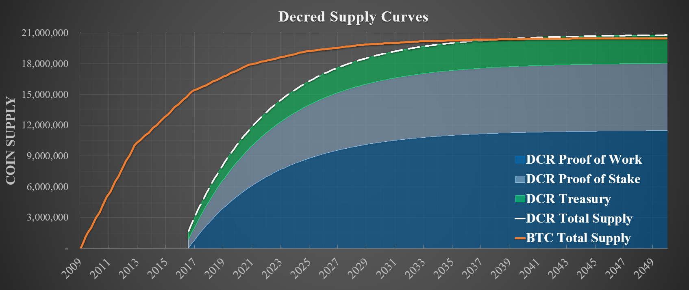
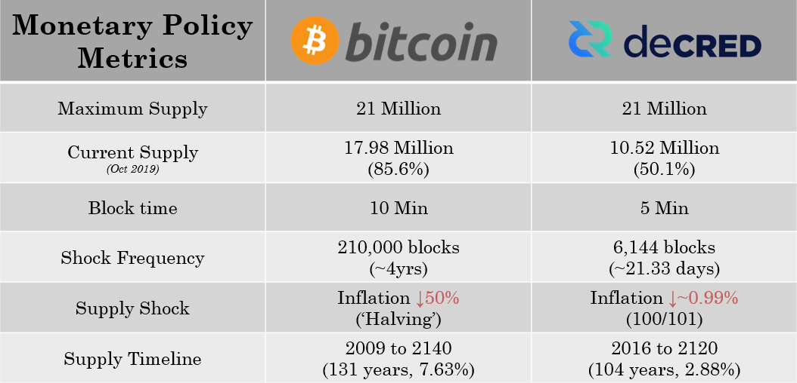
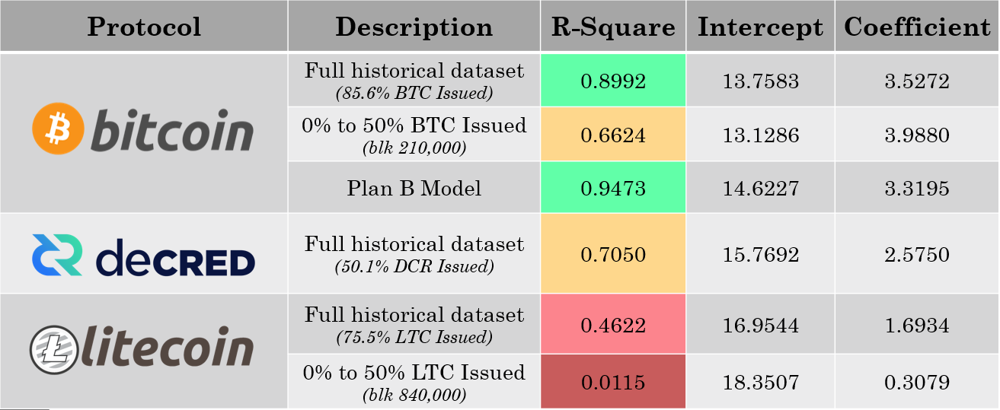
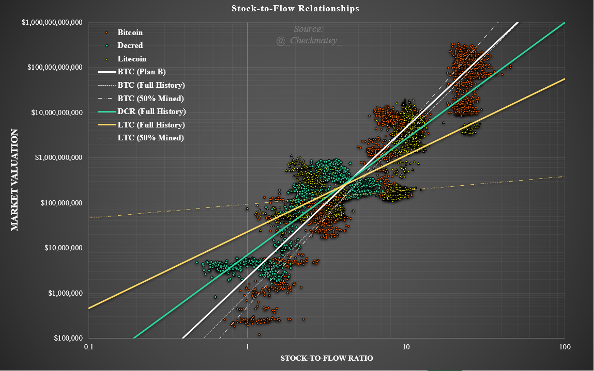
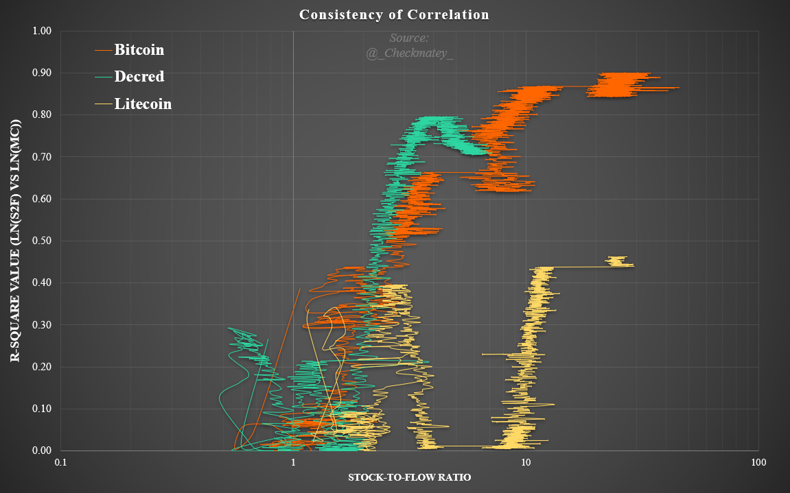
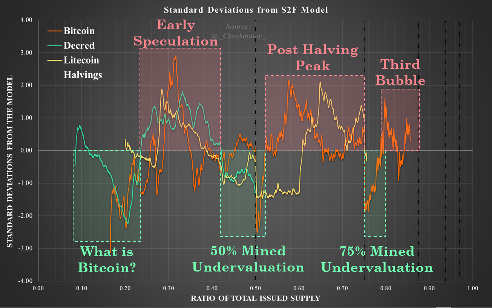
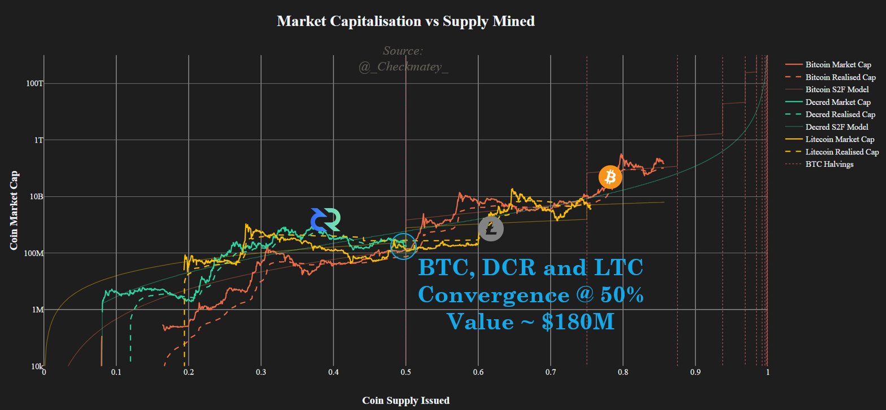

# Decred, following in Bitcoin's Footsteps
*by Checkmate*

*14-Oct-2019*

In my opinion, **Decred** is the most promising cryptocurrency project and a sound competitor next to **Bitcoin** in the free market for digital and scarce monetary assets. At an absolute mininimum, strong market competition market forces innovation and hardening of the strongest protocols whilst also providing a rational risk hedge during the nascent development of digital money.

As **Bitcoin**  continues to assert it's market dominance, it is the correct benchmark against which competitors must be compared. The following article is the first of three parts and the culmination of a number of months study into **Decred** from a data driven, first principles perspective.

This is the first of three papers to compare the performance of **Decred** and **Bitcoin** across the following key value metrics:

1. Monetary policy and Scarcity
2. Cost of Security and Unforgeable Costliness
3. Governance, User Adoption and Resilience

# Background

Previously I explored a [comparison between Alt-coins and **Bitcoin**](https://medium.com/@_Checkmatey_/monetary-premiums-can-altcoins-compete-with-bitcoin-54c97a92c6d4) in regards to their Monetary Premiums. This study considered a simple methodology relating scarcity, as measured by stock-to-flow ratio, to market value inspired the work of [Plan B](https://medium.com/@100trillionUSD/modeling-bitcoins-value-with-scarcity-91fa0fc03e25) for **Bitcoin**). This study established the existence of a fundamental power law relationship for **Bitcoin** that acts as a valuable baseline against which fixed supply cryptoassets may be compared.

A key outcome of this paper was the observation that **Decred** has developed and maintained a convincing monetary premium well in excess of the other alt-coins considered, but in fact even more so than **Bitcoin** in its early days. As such, it appears appropriate to continue this study to quantify the validity of the observation.

What I explore further in this article, is the depth to which **Decred's** market valuation and performance to date is comparable to that of **Bitcoin** in its early history. An apples to apples comparison.

## Disclosure

*This paper was written and researched as part of an [accepted research proposal](https://proposals.decred.org/proposals/78b50f218106f5de40f9bd7f604b048da168f2afbec32c8662722b70d62e4d36) by the Decred DAO and thus the writter was paid in DCR for their time undertaking the research. Nevertheless, this study aims to be a factual study based on publicly available market and blockchain data. All findings may be readily verified by readers and all assumptions shall be clearly stated.*

# Why Decred?
**Decred** is founded on the same core sound money principles as **Bitcoin** yet differentiates significantly in three very meaningful ways, namely:

1. **Decred's Security** and consensus utilises an innovative and elegant Hybrid PoW/PoS mechanism. This system can reasonably provide superior [ledger assurances](https://medium.com/@permabullnino/introduction-to-crypto-accounting-an-analysis-of-decred-as-an-accounting-system-4d3e67fce28?source=search_post---------2) (Permabull Nino, 2019) and a higher cost of attack (between 20x and 40x) per unit of market capitalisation when compared to **Bitcoin** ([Zubair Zia, 2018]((https://medium.com/decred/decreds-hybrid-protocol-a-superior-deterrent-to-majority-attacks-9421bf486292)) and [Fiach_Dubh, 2019](https://medium.com/coinmonks/comparing-double-spend-resistance-decred-vs-bitcoin-part-1-330c8081b2a9)).

2. **Pre-established Governance Mechanism** which allocates decision making capacity and risk ownership to DCR holders. The governance system is comprised of off-chain signaling via [Politeia](https://proposals.decred.org), social media channels (Matrix, Twitter, Reddit etc.) and binding on-chain voting for consensus level changes via the **Decred** ticket system. Decred governance is underpinned by the [Decred constitution](https://docs.decred.org/governance/decred-constitution/) coupled with a remarkably strong [social contract](https://medium.com/@NoahPierau/unpacking-decreds-social-contract-69c413aa652) (Haon, 2019) that to date has proven its capacity for retaining community integity and mindshare. The **Decred** governance mechanism enables efficient yet distributed coordination for implimenting protocol upgrades and mitigate future risks.

3. **Distribution of block rewards** allocated as 60% to Proof-of-work miners in return for CAPEX and OPEX costs, 30% to DCR ticket holders to incentivise governance participation and security and the final 10% to the **Decred** Treasury which is owned ([and soon to be operated by](https://proposals.decred.org/proposals/c96290a2478d0a1916284438ea2c59a1215fe768a87648d04d45f6b7ecb82c3f)) **Decred** stakeholders. Decred effectively incentivises participation of Miners, Stakeholders and Builders in contrast to **Bitcoin's** 100% allocation to Proof-of-Work Miners. This makes the Decred protocol one of the largest operational decentralised autonomous organisations with over [646,275 DCR ($10.34M)](https://explorer.dcrdata.org/address/Dcur2mcGjmENx4DhNqDctW5wJCVyT3Qeqkx?chart=balance&zoom=ijhhasg0-k1st3q80&bin=month&txntype=merged_debit) in assets stored in the Treasury at the time of writing.

In this light, **Decred** has a uniquely differentiated value proposition amongst the landscape of crypto-assets and represents a strong digital monetary store of value candidate.

**Decred** thus presents a valuable opportunity to study the early age performance of a contender for digital money with the benefit of **Bitcoin** hindsight.

# Part 1 - Monetary Policy

## Commonalities 
The core value proposition of **Decred** is near identical to **Bitcoin** in that it presents an opt-in, self-sovereign and immutable digital store of value.

**Decred** has thus retained the core sound money principles of **Bitcoin** including:
- 21 million maximum unit supply of DCR
- 100,000,000 divisible units (atoms) per DCR, equivalent to satoshis of Bitcoin
- Deterministic supply schedule by block height

Decred's overall supply curve actually approaches that of **Bitcoin** with comparable circulating supplies estimated around Mar 2038.

## Differences

Material differences between **Decreds** and **Bitcoins** monetary policies can be summarised as:
- Decred launched with an 8% premine (1.68 million DCR) with half (864k DCR) airdropped free to community members to bootstrap Proof-of-Stake security and the other half purchased by the team at a rate of $0.49/DCR. Bitcoin launched without a pre-mine and instead launched with only a small collective of cypherpunks aware if it's existence. Both systems acted as a reward structure for those who nurtured the network through early life. Within the first year it is estimated that Satoshi Nakamoto was the dominant Bitcoin miner who owns an estimated 700k to 800k BTC ([BitMex, 2018](https://blog.bitmex.com/satoshis-1-million-bitcoin/); [Held, 2018](https://blog.picks.co/bitcoins-distribution-was-fair-e2ef7bbbc892)).

- The **Decred** block reward starts at 31.19582664 DCR per ~5min block time and the reward is distributed at a rate of 60% / 30% / 10% to Proof-of-Work miners, Proof-of-Stake Stakeholders and the **Decred** Treasury Fund, respectively. This compares to **Bitcoin** that starts at 50 BTC per block issued every ~10mins allocated in full to Proof-of-Work miners.

- **Decred's** monetary policy does not include a significant supply shock 'halving' event as **Bitcoin** does every 210,000 blocks (~4 years). Instead, its block reward follows a smooth reduction by [100/101 every 6,144 blocks](https://docs.decred.org/advanced/inflation/), equating to a reduction of approximately 0.99% to the total block reward every 21.33days. The effective inflation half-life is approximately equal at around 4years.

Key monetary policy characteristics of Bitcoin and Decred are summarised in the table below.

To illustrate the similarity between monetary policies, we can superimpose **Decred** launching at the block-height when **Bitcoins** circulating supply reached 1.68million BTC (equivalent to **Decreds** initial pre-mine = BTC block 33,600) to compare progression of the stock-to-flow ratios and supply curves.

What is immediately clear is that **Decreds** stock-to-flow development approximates the mean trajectory of **Bitcoin** and traverses the same set of stock-to-flow values with exception of halving events. 

Plan B has shown that a fundamental power-law relationship between stock-to-flow is valid for **Bitcoin**. It reasonably follows that a similar linear regression calculation may be undertaken for **Decred** as a gauge for the monetary premium it has developed. The regression fit and constants may be compared with respect to the age of the coin and state of progress through its issuance schedule. 

In the instance **Bitcoin** continues to outperform in this relationship it may be reasonably attributed to the combined influence of Satoshi's immaculate conception, first mover advantage, network effects and the halving supply shock events. If on the other hand a comparable monetary premium and model confidence is observed for **Decred**, it supports further consideration of **Decred** as a viable digital store of value candidate.

For comparison, the same calculation will be undertaken for **Litecoin** which launched in 2011 and for all intents an purposes represents a direct fork of **Bitcoin** with minimal alteration to the protocol or monetary policy.

# Methodology

The regression analysis has been undertaken as follows:

1) Data is aquired for BTC, DCR and LTC from the coinmetrics.io community dataset. Early price data for Bitcoin is supplemented with data originally used in Plan B's model. Similarly, DCR data is supplemented with the genesis pricing of $0.49/DCR and early data from Bittrex not included in the coinmetrics dataset. Data is considered on a daily basis.

2) Calculate the daily annual inflation rate of native coins (assuming 365.25 days/yr) and the corresponding Stock-to-Flow ratio. Assuming a power-law relationship exists, the natural logarithm of both S2F and Market Cap are taken and used in linear regression models.

3) Considering the quality of a regression analysis is dependant on the size of the dataset, an additional set of calculations are undertaken looking at the R-Squared coefficient. This aims to observe the quality of the Bitcoin model fit over time for due consideration of the age difference between **Bitcoin**, **Decred** and **Litecoin**. It is expected that if a sound monetary premium is developing for an asset, the model fit will improve over time leading to an increasing R-square as more market data comes to light.

4) Results are presented normalised against Stock-to-Flow Ratio and the Proportion of total supply issued to normalise for the age of each protocol.

The model spreadsheet is available here for inspection and verification.

# Analysis Result
## Stock-to-Flow Relationships

The results of the linear regression analysis including model parameters and R-square fit coefficients are presented in the table and figure below. For Bitcoin and Litecoin, a second regression analysis considering only the first four years of data (pre-halving 1) to align with Plan B's original analysis which showed four years of data provided a very strong model fit.

By plotting the market valuation against stock-to-flow ratio in log-log space, we can verify visually that the linear regression calculation indeed matches the available market data for each protocol.

There are a number of observations and considerations which must be taken into account when interpreting these results.

## Bitcoin
All three **Bitcoin** regression models are reasonably consistent in fit and show an improved R-square coefficient as larger data-sets and more history is considered. Indeed the full history of Bitcoin very closely matches the model developed by Plan B.

Plan Bs original model utilised monthly price data (first of each month) whereas this study considers the average daily close price data. Whilst the overall outcome is similar, the pre-halving model fit using the set of daily **Bitcoin** daily data provides an R-square value of only 0.6624, a marked reduction from ~0.90 when considering a monthly distribution of data for the full history.

This highlights the importance of temporal distribution of the data which has shown to make statistically significant differences to the model fit. At halving events for example, there is a significant change to Bitcoin's Stock-to-flow ratio which is not immediately followed by an equivalent shift in network valuation. Therefore one must be cautious to select data that is not heavily weighted of skewed by data immediately after a halving event.

Nevertheless, given the full suite of price data for **Bitcoin** it is the authors opinion that Bitcoin has an undeniable monetary premium and indeed is an appropriate baseline to which other models should be compared. This analysis provides yet another independant verification that a strong relationship exists between stock-to-flow and network valuation for **Bitcoin**.

## Decred
**Decred** has shown a statistically significant relationship between Stock-to-Flow and market valuation with an R-square value of 0.70 considering only the first three years of price data. It may be seen that this relationship is comparable to **Bitcoins** at the time of the first halving with an R-square of 0.66.

The early tail of the data plotted above speaks to the difference in market dynamics at the time when first price data first became available for each protocol. Despite high early inflation, **Decreds** tail is consistent around a market value of $5Million until the S2F ratio approaches 2.0 at which point price accelerates during the 2016-17 bull run. **Bitcoin** on the other hand experienced a far slower growth during the 2011-12 bull market with a smaller pool of participants. Early **Bitcoin** price data sources range from Laszlo's 10,000 BTC pizza to early Mt Gox pricing. 

It must therefore be noted that the gradient of these relationship is heavily weighted by this tail end especially during the first 3-4 years of life, an effect **Bitcoin** has overcome with its not 10+ years of price data. It remains to be seen whether **Decred** posts strong performance into the future which will refine whether the model remains statistically valid.

The overall shape of **Decred**s relationship with S2F appears to be oscillating around the mean regression line. **Decreds** relationship over time appears smoother than **Bitcoin** or **Litecoin**, potentially a result of the smooth issuance curve and lack of severe halving event supply shocks. 

This model must be revised in the next 12-24 months as it is likely the regression fit will be improved if **Decred** experiences strong market performance over this time. Similarly, poor future performance would negatively influence the regression fit.

In summary, **Decred** is showing early signs of developing a strong moentary premium based on it's scarcity as measured by stock-to-flow ratio. The coming years will be critical in validating this model, particularly over the next 12-24 months.

## Litecoin
**Litecoin**
Based on the results and sensitivity studies presented it is concluded that Litecoin has not developed what the author considers a convincing monetary premium. This is consistent with the [original screening analysis](https://medium.com/@_Checkmatey_/monetary-premiums-can-altcoins-compete-with-bitcoin-54c97a92c6d4) which is now statistically validated by the low R-square which is not imporved by any significant magnitide by adjusting the resolution of data inputs. 

It is the authors opinion that Litecoin does not display a convincing relationship between stock-to-flow scarcity and market valuation.

## R-Square Development over time

To quantify the relative model fits and account for different timescales of data considered in the analysis, the development of the R-square coefficient has been plotted against Stock-to-Flow. This shows the confidence in a S2F-Value relationship for **Bitcoin**, **Decred** has increased over time with a depression in the lead up to the point of 50% of supply mined. 

For **Bitcoin** this is explained by the first halving event which increases S2F with no direct impact on value leading to an immediate undervaluation. For **Decred** this may reasonably be attributed to the generally low market engagement towards alt-coins during the pre-2020 halving **Bitcoin** bull market. Again, **Litecoin** can be seen to perform poorly over it's entire trading history with a peak R-square value of around 0.46.

By comparing the deviation of each protocols valuation from the model (full history) as a ratio to the standard model error, we can observe repeated fractals indicating undervaluation and overvaluation.

## Projections

