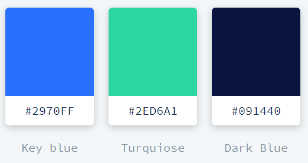
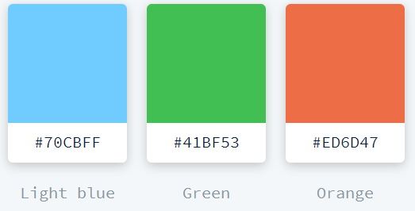

# Matte Colours
|COLOUR   	   |RGB COLOUR   	        |
|:-:	       |:-:	                    |
| WHITE        | 'rgb(255, 255, 255)'   |
| MINT GREEN   | 'rgb(113, 255, 177)'   |
| BLUE         | 'rgb(0, 153, 255)'     |
| YELLOW       | 'rgb(254, 215, 140)'   |
| RED          | 'rgb(112, 203, 255)'   |
| DEEP RED     | 'rgb(200, 92, 92)'     |
| PURPLE       | 'rgb(102, 102, 153)'   |
| PALE BLUE    | 'rgb(102, 153, 255)'   |
| GREY         | 'rgb(216, 216, 216)'   |
| CHART GREY   | 'rgb(39,40,34)'        |
| GRID GREY    | 'rgb(127,127,127)'     |

# Strong Colours
|COLOUR   	   |RGB COLOUR   	        |
|:-:	       |:-:	                    |
| GREEN        | 'rgb(1, 255, 116)'     |
| BLUE         | 'rgb(20, 169, 233)'    |
| YELLOW       | 'rgb(255, 192, 0)'     |
| RED          | 'rgb(250, 38, 53)'     |
| PURPLE       | 'rgb(114, 49, 163)'    |
| ORANGE       | 'rgb(239, 125, 50)'    |

# Red --> Green Gradient
|COLOUR   	    |RGB COLOUR   	           |
|:-:	        |:-:	                   |
|Red            |  'rgb(255, 80, 80)'      |
|Orange         |  'rgb(255, 102, 102)'    |
|Orange-Yel     |  'rgb(255, 153, 102)'    |
|Yellow         |  'rgb(255, 204, 102)'    |
|Yel-Green      |  'rgb(255, 255, 102)'    |
|Green          |  'rgb(153, 255, 102)'    |

# COIN SPECIFIC COLOURS
|COLOUR   	            |RGB COLOUR   	        |
|:-:	                |:-:	                |
|BTC (Burnt Orange)     |  'rgb(255, 102, 0)'   |
|LTC (Grey)             |  'rgb(214, 214, 194)' |
|BCH (Green)            |  'rgb(0, 153, 51)'    |
|DASH (Light Blue)      |  'rgb(51, 204, 255)'  |
|DCR (Turqoise)         |  'rgb(46, 214, 161)'  |
|XMR (Light Orange)     |  'rgb(255, 153, 0)'   |
|ZEC (Yellow)           |  'rgb(255, 255, 0)'   |
|ETH (Purple)           |  'rgb(153, 51, 255)'  |
|XRP (Dark Blue)        |  'rgb(51, 102, 255)'  |

# DECRED COLOURS
|COLOUR   	   |    RGB COLOUR   	    |
|:-:	       |    :-:	                |
|KEY BLUE      |    'rgb(41, 112, 255)' |
|TURQOISE      |    'rgb(46, 214, 161)' |
|DARK BLUE     |    'rgb(9, 20, 64)'    |
|LIGHT BLUE    |    'rgb(112, 203, 255)'|
|GREEN         |    'rgb(65, 191, 83)'  |
|ORANGE        |    'rgb(237, 109, 71)' |

